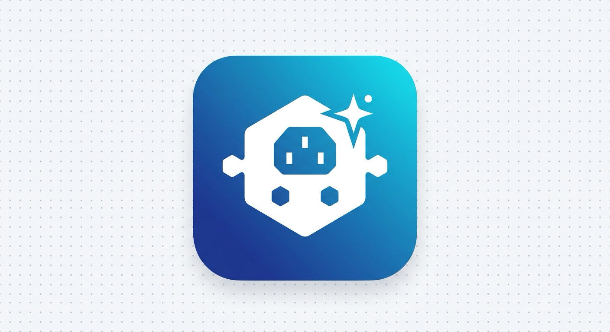

<p align="center">
  
</p>

<h1 align="center">Awesome DSH Plugins</h1>

<p align="center">
  Curated plugins, tools and extensions for <a href="https://github.com/deepseek-ai/deepseek-harness">DeepSeek Harness</a> / DSH.
</p>

<p align="center">
  <a href="README.zh-CN.md">简体中文</a>
</p>

This list is written from the plugins **actually installed** on a local DSH instance
(`~/.dsh/profiles/web` — the `dsh web` profile). Each entry notes the installed
version and the plugin-to-plugin dependencies observed locally.

## Contents

- [Installed Plugins](#installed-plugins)
- [Image Generation](#image-generation)
- [Cost & Usage](#cost--usage)
- [Workflow](#workflow)
- [Compatibility](#compatibility)
- [Plugin Dependencies](#plugin-dependencies)
- [Install](#install)
- [License](#license)

## Installed Plugins

Plugins currently installed in the local `web` profile
(`~/.dsh/profiles/web/package.json`):

| Plugin | Version | Type | Source |
| --- | --- | --- | --- |
| `@LiuRJ99/dsh-cpa-plugin` | 0.3.0 | Model provider (LLM) | [github.com/LiuRJ99/dsh-cpa-plugin](https://github.com/LiuRJ99/dsh-cpa-plugin) |
| `@LiuRJ99/dsh-workbuddy-provider` | 0.2.0 | Model provider (LLM) | [github.com/LiuRJ99/dsh-workbuddy-provider](https://github.com/LiuRJ99/dsh-workbuddy-provider) |
| `dsh-better-sidebar` | 0.16.0 | Web UI | [github.com/omdsh-dev/DSH-better-sidebar](https://github.com/omdsh-dev/DSH-better-sidebar) |
| `dsh-image-gen` | 0.2.0 | Image generation | [github.com/LiuRJ99/dsh-image-gen](https://github.com/LiuRJ99/dsh-image-gen) (fork of [shanliuling/dsh-image-gen](https://github.com/shanliuling/dsh-image-gen)) |
| `dsh-sandbox-schema-shim` | 0.1.1 | Compatibility shim | [github.com/xiaohj233/dsh-compat-shims](https://github.com/xiaohj233/dsh-compat-shims) |
| `dsh-spend` | 0.5.0 | Cost & usage | [github.com/nonewind/dsh-spend](https://github.com/nonewind/dsh-spend) |
| `dsh-taskboard` | 0.5.1 | Workflow / task board | [github.com/LiuRJ99/dsh-taskboard-cloader](https://github.com/LiuRJ99/dsh-taskboard-cloader) (fork of [cloader/dsh-taskboard](https://github.com/cloader/dsh-taskboard)) |

## Image Generation

- [dsh-image-gen](https://github.com/LiuRJ99/dsh-image-gen) —— image generation for DSH (Gemini, OpenAI, Seedream, DashScope and more) · **installed v0.2.0** ✅ — user's fork of [shanliuling/dsh-image-gen](https://github.com/shanliuling/dsh-image-gen), CPA-adapter build; requires `@LiuRJ99/dsh-cpa-plugin` ≥ 0.3.0 (see [Plugin Dependencies](#plugin-dependencies)). Local engine config: `image-generation.engine: gemini`, saving into `dsh-image-gen/` workspace folder.
- `@LiuRJ99/dsh-cpa-plugin` (`image-generation` subpath) —— the CPA provider also exposes image-capable models (`gemini-3.1-flash-image`, `gpt-image-1.5`, `gpt-image-2`) · **installed v0.3.0** ✅

## Cost & Usage

- [dsh-spend](https://github.com/nonewind/dsh-spend) —— token usage, multi-dimensional statistics, auto-detected billing plans (Code/Token) and estimated spend for the dsh web UI · **installed v0.5.0** ✅

## Workflow

- [dsh-taskboard](https://github.com/LiuRJ99/dsh-taskboard-cloader) —— agent-first task board for the DSH web GUI: host-authoritative ledger with `taskboard_*` agent tools, project claim boundaries, per-task model execution, cron scheduling, git-worktree isolation and a live SSE kanban view · **installed v0.5.1** ✅ — user's fork of [cloader/dsh-taskboard](https://github.com/cloader/dsh-taskboard) with local modifications (local source dir `dsh-taskboard-cloader`)

## Compatibility

- [dsh-sandbox-schema-shim](https://github.com/xiaohj233/dsh-compat-shims) —— removes redundant sandbox escalation fields from model-facing shell / file tool schemas in `danger-full-access` sessions · **installed v0.1.1** ✅ (package `dsh-sandbox-schema-shim` from the `dsh-compat-shims` monorepo)

## Plugin Dependencies

Observed from the installed packages' `dependencies` / `peerDependencies` and source imports:

```text
dsh-image-gen 0.2.0 ──(hard)──▶ @LiuRJ99/dsh-cpa-plugin ≥0.3.0 <0.4.0
                                  (imports '@LiuRJ99/dsh-cpa-plugin/image-generation')

@LiuRJ99/dsh-cpa-plugin ──────────▶ @deepseek-ai/dsh-llm, dsh-credentials, dsh-settings
                                    (registers 'CLIProxyAPI' provider into llm-pi-ai)

@LiuRJ99/dsh-workbuddy-provider ──▶ @deepseek-ai/dsh-llm, dsh-credentials, dsh-settings
                                    (registers 'WorkBuddy' provider, local port 8318)

dsh-better-sidebar ──────────────── service provider: exposes ctx.betterSidebar
                                    (registerTab / registerFileViewer) for other plugins;
                                    optional integration, no reverse hard dependency

dsh-taskboard ───────────────────── zero peer deps; self-contained
dsh-spend ───────────────────────── depends on official @deepseek-ai/cordis,
                                    @deepseek-ai/dsh-home-paths,
                                    dsh-typert-protocol, schemastery only
dsh-sandbox-schema-shim ─────────── standalone shim, no third-party deps
```

Key takeaways:

1. **`dsh-image-gen` 0.2.0 has a hard dependency on `@LiuRJ99/dsh-cpa-plugin` ≥ 0.3.0** — install the CPA plugin first, otherwise image generation fails to resolve.
2. **`dsh-cpa-plugin` and `dsh-workbuddy-provider` are sibling model-provider plugins** registered into the official `llm-pi-ai` provider registry (`CLIProxyAPI` on port 8317, `WorkBuddy` on port 8318). They are independent of each other.
3. **`dsh-better-sidebar` is an optional service provider** — plugins may register sidebar tabs / file viewers through `ctx.betterSidebar`; none of the currently installed plugins require it.
4. **`dsh-taskboard`, `dsh-spend` and `dsh-sandbox-schema-shim` are self-contained** — no inter-plugin dependencies.

## Install

```bash
# Add a plugin to the web profile
dsh plugin --profile web add <package-or-github-ref>

# Example: install from npm (prebuilt)
dsh plugin --profile web add dsh-taskboard

# Example: install from GitHub monorepo subpath
dsh plugin --profile web add "github:xiaohj233/dsh-compat-shims#sandbox-schema-shim-v0.1.1&path:/packages/sandbox-schema-shim"
```

Restart `dsh web` and refresh the page after installing.

## License

The listing itself is MIT. Each plugin keeps its own license
(`dsh-taskboard` is Apache-2.0, the others are MIT).
