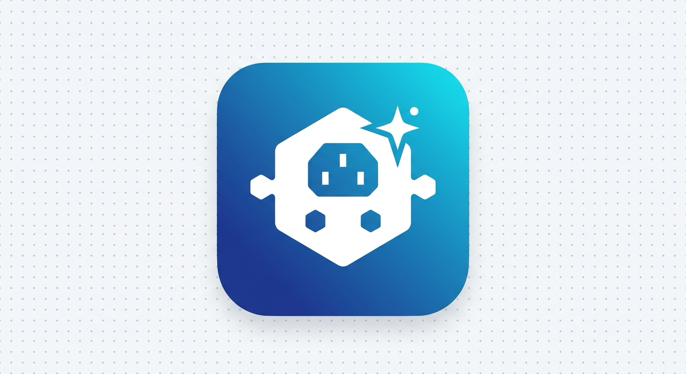

<p align="center">
  
</p>

<h1 align="center">Awesome DSH Plugins</h1>

<p align="center">
  面向 <a href="https://github.com/deepseek-ai/deepseek-harness">DeepSeek Harness</a> / DSH 的社区插件目录。
</p>

<p align="center">
  <a href="README.md">English</a>
</p>

本目录列出每个公开插件的用途、准确的公开安装来源、前置条件，以及特殊交付例外。
稳定条目使用固定的 registry 版本、Git release/tag、精确 commit 或 release tarball。

本目录**刻意不记录任何机器状态**。具体已装版本、本机路径和 profile 布局属于运行 DSH 的人，
不属于这份目录——这类内容每次安装都会过期。要看某台机器实际装了什么，去查那台机器：

```bash
dsh --profile <profile> --dump-config
```

私有仓库和机器本地集成不会列入这份公开目录，因为它们无法成为对所有 DSH 用户都可移植的安装物料。

## 目录条目规范

公开条目必须回答五个问题：

1. **它做什么？** 用一句话说明能力，并链接到权威仓库。
2. **它从哪里来？** 给出精确 registry 版本、Git release/tag、commit 或 release asset；
   如果安装器存在例外，必须明确写出。
3. **它需要什么？** 列出会影响安装或运行的 Host、运行时、provider、凭据、权限和 native service 前置条件。
4. **谁依赖它？** 说明 provider 先于消费者的顺序，并把可选集成和必需依赖区分开。
5. **如何验收？** 给出可复现的检查，并披露本地路径、信任边界、远程暴露和其他安全敏感副作用。

目录中不得出现某台机器的绝对路径、复制来的 profile 状态、私有凭据，或“当前已安装某版本”的表述。

## 目录

- [目录条目规范](#目录条目规范)
- [安装前须知](#安装前须知)
- [同名冲突：按来源安装，不要按包名安装](#同名冲突按来源安装不要按包名安装)
- [从 Git 主机安装](#从-git-主机安装)
- [插件目录](#插件目录)
- [固定安装示例](#固定安装示例)
- [依赖关系](#依赖关系)
- [与上游的关系](#与上游的关系)
- [特殊产品](#特殊产品)
- [插件目录之外的 macOS 服务](#插件目录之外的-macos-服务)
- [验证清单](#验证清单)
- [许可证](#许可证)

## 安装前须知

1. **固定每一个可移植来源。** 只能用 registry 精确版本、受保护的 Git release/tag、
   精确 commit，或带 checksum 的 release tarball。禁止 `latest`、`main`、未固定分支，
   以及其他机器的 `link:`。Browser 安装器有明确记录的远程 bootstrap 例外；可复现路径是
   精确 tag 的本地 checkout，远程 fallback 只适合作为便利安装，不能视为固定来源。
2. **先在 candidate profile 验证。** 把插件加到一次性 profile 里，确认 DSH 能加载，
   再去动你真正在用的 profile。
3. **provider 先于消费者安装。** 提供模型或运行时服务的插件，必须先于依赖它的插件存在。
4. **不要手工维护 `dsh.profile.bundles`。** 每次 `dsh plugin add` 成功后让 DSH 自动 reconcile。
5. **不要手工修改 profile `node_modules` 里的文件。** 这种改动没有版本控制来源，
   `package.json` 也不再描述它，其他机器无法复现，下一次重装会静默还原。
   如果某个修复值得保留，它属于插件仓库——提交、打 tag、发布，然后安装那个已发布的 tag。
6. **不要在不同机器之间复制 `package.json`、lockfile 或 `node_modules`。**
   改为从固定的来源重新安装。
7. **迁移到正式 profile 后重启。** candidate 已通过不代表正在运行的正式 DSH 进程已经加载新物料，
   必须重启正式 profile。
8. **用构建该 profile 的 pnpm 运行 `dsh plugin`。** `dsh plugin` 会调用 `PATH` 上的 `pnpm`，
   而 profile 的 `node_modules` 记录了创建它的 store。不同大版本的 pnpm 会拒绝操作：

   ```text
   ERR_PNPM_UNEXPECTED_STORE
   ```

   遇到该错误时，应把构建该 profile 的 pnpm 版本放到 `PATH` 最前面，而不是重装整个 profile。
   另外，在 pnpm ≥ 11 下构建脚本授权位于 `pnpm-workspace.yaml`（`allowBuilds`），
   而 profile `package.json` 的 `pnpm` 字段已被忽略。

### `link:` 仅用于本机开发

只有在机器本地的开发 profile 中，且源码 checkout 已构建、运行时入口已确认之后，
才可以使用 `link:` 依赖。`link:` 不会执行目标包的 build，也不是可移植的安装格式。

## 同名冲突：按来源安装，不要按包名安装

本目录中有若干插件与公共 npm registry 上的**无关项目重名**。按裸包名安装会静默装错项目——
名字相同，代码不同：

| 裸包名 | 实际会装到 | 权威来源 |
| --- | --- | --- |
| `dsh-taskboard` | `cloader/dsh-taskboard` | `LiuRJ99/dsh-taskboard-cloader` |
| `dsh-spend` | `nonewind/dsh-spend` | `LiuRJ99/dsh-spend` |
| `dsh-image-gen` | `shanliuling/dsh-image-gen` | `LiuRJ99/dsh-image-gen` |
| `dsh-github-mcp` | `ZIye1208/dsh-github-mcp` | `GitRuozhi/dsh-github-mcp` |

这四个绝不能按裸包名安装。执行任何 `dsh plugin add` 之前，先看下方目录表中的固定来源：
Git 交付条目使用 tag/commit，ImageGen 使用经过校验的 release tarball。

## 从 Git 主机安装

`github:` 安装是否可行取决于仓库布局，因为 pnpm 不会执行 git 托管依赖的构建脚本，
除非消费者显式允许：

- **把构建产物 `lib/` 提交进仓库**的项目，可直接用
  `github:<owner>/<repo>#<tag>` 安装；
- **把构建产物写进 `.gitignore`** 的项目则不行：包会带着指向快照中不存在文件的 `main` 到达。
  这类项目只能走 release tarball 或仓库自带的安装器。

如果某个插件从 Git 主机安装后报入口文件缺失，先检查它的 `lib/`（或对应的 `main` 目标）
是否被 gitignore 了。

## 插件目录

| 插件 | 能力 | 安装来源 | 前置条件 |
| --- | --- | --- | --- |
| [`@LiuRJ99/dsh-cpa-plugin`](https://github.com/LiuRJ99/dsh-cpa-plugin) | CLIProxyAPI 模型供应商、GPT/Codex Responses 路由、账号/配额界面（含 Kimi Code）、速度模式、图片生成服务 | GitHub Release `v0.4.8` | DSH peer 服务；用户自行配置 CPA 地址和凭据 |
| [`@LiuRJ99/dsh-workbuddy-provider`](https://github.com/LiuRJ99/dsh-workbuddy-provider) | 将本地 Tencent WorkBuddy/CodeBuddy 模型接入 DSH 的 OpenAI 兼容 provider | GitHub Release `v0.2.7` | Node `≥20.18.1`；已登录的 WorkBuddy/CodeBuddy 桌面会话；本地 bridge 默认监听 `127.0.0.1:8318` |
| [`@yuxianglin/dsh-bridge-browser`](https://github.com/LiuRJ99/dsh-browser) | 浏览器 bridge 工具与 Chrome/Firefox 扩展集成 | GitHub Release `v0.1.12-dev.1` bridge tarball + Chrome extension zip；bridge `0.0.12-dev.1` | Node/pnpm；需同时构建 bridge 和 Chrome 扩展；Firefox 需要下文的手动 Firefox 构建和 token 配置 |
| [`@zibokapi/dsh-codex-computer-use`](https://github.com/LiuRJ99/dsh-computer-use) | macOS 应用状态、Accessibility Tree、截图、鼠标键盘输入、MCP 服务 | GitHub Release `v0.1.6-dev.2` | macOS、Xcode Command Line Tools、重建 native daemon、Accessibility 与 Screen Recording 授权 |
| [`dsh-better-sidebar`](https://github.com/omdsh-dev/DSH-better-sidebar) | Web 侧栏、资源管理器、编辑器、终端、Git、浏览器界面；`ctx.betterSidebar` 服务 | registry 精确版本 `0.24.1` | Taskboard 和 ImageGen 的可选 UI 服务；`0.24.1` 声明 DSH `^0.2.0-rc.1` peer；消费者的可选 peer 已覆盖该版本，见兼容性说明 |
| [`dsh-decision-engine`](https://github.com/LiuRJ99/dsh-decision-engine) | 面向 DSH 的模型中立低延迟决策层：提供可插拔决策引擎与 Provider、有限候选集决策协议，以及 Browser / Computer / Custom 环境适配器 | GitHub Release `v0.4.18` | DSH peer 服务；可选 `@receptron/laya` 提供本地推理；若启用 browser/computer 适配器需相应宿主工具/插件支持 |
| [`dsh-github-mcp`](https://github.com/GitRuozhi/dsh-github-mcp) | GitHub 官方 MCP server 桥接（`mcp__github__*`）与 REST 文件读取 | 精确 Git commit `5be9077d46bfed66b76843bbcc7bdc459990b3af`（上游未发布 tag） | DSH 进程环境中的 `GITHUB_TOKEN`；DSH 通常从 `$DSH_HOME/.env` 加载 |
| [`dsh-image-gen`](https://github.com/LiuRJ99/dsh-image-gen) | CPA 图片生成、图片模型目录、图片编辑、Gallery 和工作区保存 | GitHub Release `v0.5.9` tarball asset；SHA-256 `a16042e2a9d16dada99da9d24a0c3356b117e1d91b52a3a9efb5aa92f8e410d5` | 先安装 CPA；ImageGen 构建时使用 CPA `v0.4.8`，其 `>=0.4.0 <0.5.0` peer 范围覆盖本目录目标 `v0.4.8`。该仓库 `.gitignore` 了 `lib/`，从 Git 安装会没有入口 |
| [`dsh-mobile`](https://github.com/saya-ch/dsh-mobile) | 从移动设备访问 DSH 会话 | registry 精确版本 `0.6.1` | 局域网与可选远程访问分别控制；远程默认关闭，已配对设备完全受信，局域网使用固定本地 CA，远程使用 provider 的 HTTPS 端点。`0.6.1` 要求 Node `^22.19 || >=24`；配套移动客户端及配对流程需本地验证 |
| [`dsh-record-replay`](https://github.com/LiuRJ99/dsh-record-replay) | `orr_*` 工具与 `open-record-replay` skill，用于录制并回放桌面操作 | 精确 Git commit `277a05b527ccfaf8e555933209e70886bf1e545d`；`0.3.3-dev.1` | macOS 与 Xcode Command Line Tools；使用精确的 fork 版 [`open-record-replay`](https://github.com/LiuRJ99/open-record-replay) tag `v0.1.1`，通过 profile patch 指定 |
| [`dsh-sandbox-schema-shim`](https://github.com/xiaohj233/dsh-compat-shims) | 清理模型侧工具 schema 中多余的沙箱字段 | Git tag `sandbox-schema-shim-v0.1.1`，package path `/packages/sandbox-schema-shim` | DSH base profile |
| [`dsh-spend`](https://github.com/LiuRJ99/dsh-spend) | Token 用量、统计、计费计划识别和费用视图 | GitHub Release `v0.6.7-dev.2` | DSH session、credentials 和 Web UI peer 服务 |
| [`dsh-taskboard`](https://github.com/LiuRJ99/dsh-taskboard-cloader) | Host 权威任务、任务工具、工作区认领、调度和看板 UI | GitHub Release `v0.7.5` | Better Sidebar 为可选集成；向 Lazy Gate 发布能力元数据 |
| [`dsh-tool-lazy-gate`](https://github.com/LiuRJ99/dsh-tool-lazy-gate) | 默认门控 browser 与 computer-use，并可按配置门控 Taskboard/录制器工具族 | GitHub Release `v0.1.4` | browser/computer 是内置默认；Taskboard 与 Record/Replay 需要 capability 配置和 adapted skill 元数据；包含 Web connection workaround |

### 兼容性说明

本轮候选目标为官方 `@deepseek-ai/dsh@0.2.0-rc.2`，未验证 `0.2.1-alpha.1`。
Browser、Computer Use 和 Spend 通过上表固定 GitHub Release 交付；Record/Replay 的 `0.3.3-dev.1` 继续使用精确 Git commit。fork 不按同名裸 npm 包安装。
完整[调整表、构建与本地验证步骤](docs/dsh-0.2.0-rc.2.zh-CN.md)及[本地验证提示词](docs/local-validation-prompt.zh-CN.md)已独立保存。

737 项插件测试通过；Linux CLI/Web 基础检查中，13 个插件激活，Computer Use 的三个原生条目禁用。
这项证据不包含模型调用、真实浏览器操作、移动配对、macOS 原生录制或完整 UI 交互。

每个 package 的 peer 范围和 `dsh.compatibility` 才是兼容声明依据。Host 的 peer 检查使用 `includePrerelease: true`，
所以 `>=0.1.7-rc.1 <0.2.0` 可以接受 `0.2.0-rc.2`，而 `^0.1.7-rc.1` 不能；不能仅凭范围的外观决定是否改写。
四个适配仓库使用精确的 `0.2.0-rc.2` 声明。Node 24 为本轮验证环境；各包的 `engines` 仍需满足。

CPA `v0.4.8` 的旧版直接依赖可能把 Host settings/config-editor 降到 0.1.7。候选 profile 必须使用
[文档中的精确 overrides](docs/dsh-0.2.0-rc.2.zh-CN.md#候选-profile-依赖解析)统一相关官方包；不要修改插件 node_modules。
Taskboard `v0.7.5` 和 ImageGen `v0.5.9` 的可选 Better Sidebar peer 已明确覆盖 `^0.21.1 || 0.24.1`。
Host 激活、资源请求和 Taskboard/Gallery 侧栏入口已验证；模型功能与权限仍须按部署环境验收，不使用版本豁免。

Record/Replay 新候选版本保留 `v0.3.1` 的打包修复。不要安装 `v0.3.0`，其未填写的 allowBuilds 占位符会让 pnpm ≥ 11 中止安装。
ImageGen `v0.5.9` 源码构建使用 CPA `v0.4.8`，CPA peer 为 `>=0.4.0 <0.5.0`；必须使用经过 checksum 验证的 Release tarball，因为 Git 忽略了 `lib/`。
DSH base 和 Web Host bundle 是宿主层，不作为社区插件列在本目录中。

## 固定安装示例

第一轮请使用新建的 `<candidate-profile>`。目标 profile 必须已经提供 DSH 官方 Web Host bundle；
它不是本目录中的社区插件。安装 CPA 前先合并上文链接的 profile overrides。Computer Use 仅在 macOS 原生服务准备好后启用；其他平台跳过该行。下面只使用公开且精确的来源：

```bash
# 先安装 provider（v0.4.8 与 v0.2.7 tag 对应的 commit）。
dsh plugin --profile <candidate-profile> add \
  "github:LiuRJ99/dsh-cpa-plugin#bd0d80adaac42046a2b54dcf9dc72ce881be5caf"
dsh plugin --profile <candidate-profile> add \
  "github:LiuRJ99/dsh-workbuddy-provider#4033d36714714e5da01d022cf0930ecd20d739b2"

# 精确 registry 版本。
dsh plugin --profile <candidate-profile> add dsh-better-sidebar@0.24.1
dsh plugin --profile <candidate-profile> add dsh-mobile@0.6.1

# 固定来源；已发布 fork 使用精确 release tag。
dsh plugin --profile <candidate-profile> add \
  "github:LiuRJ99/dsh-decision-engine#v0.4.18"
dsh plugin --profile <candidate-profile> add \
  "github:LiuRJ99/dsh-computer-use#v0.1.6-dev.2"
dsh plugin --profile <candidate-profile> add \
  "github:GitRuozhi/dsh-github-mcp#5be9077d46bfed66b76843bbcc7bdc459990b3af"
dsh plugin --profile <candidate-profile> add \
  "github:LiuRJ99/dsh-record-replay#277a05b527ccfaf8e555933209e70886bf1e545d"
dsh plugin --profile <candidate-profile> add \
  "github:xiaohj233/dsh-compat-shims#ba4088c1a7b77b1c73fd5d5438f46800720d6bcd&path:/packages/sandbox-schema-shim"
dsh plugin --profile <candidate-profile> add \
  "github:LiuRJ99/dsh-spend#v0.6.7-dev.2"
dsh plugin --profile <candidate-profile> add \
  "github:LiuRJ99/dsh-taskboard-cloader#v0.7.5"
dsh plugin --profile <candidate-profile> add \
  "github:LiuRJ99/dsh-tool-lazy-gate#3e8ebe3edbd7db86549fd3bee3ab7b1256e5d2aa"

# 迁移前检查组合后的 candidate。
dsh --profile <candidate-profile> --dump-config
```

candidate 通过后，用相同的精确来源重复安装到正式 profile，并重启 DSH。
不要把 candidate 的 `package.json`、lockfile 或 `node_modules` 复制到另一台机器。

## 依赖关系

```text
DSH base + DSH Web Host
├─ Better Sidebar ── 可选 UI 服务 ──┬─ Taskboard
│                                  └─ ImageGen
├─ CPA Provider ── 必需运行时服务 ── ImageGen
├─ WorkBuddy Provider ── 本地 WorkBuddy/CodeBuddy 模型 bridge
├─ Taskboard ── 能力元数据契约 ── Lazy Gate
├─ Record/Replay ── 能力元数据契约 ── Lazy Gate
├─ Record/Replay ── 调用 bin/orr.js ── fork 版 open-record-replay checkout
├─ GitHub MCP ── 读取 GITHUB_TOKEN ── DSH 进程环境（通常为 $DSH_HOME/.env）
├─ Browser bridge ↔ Chrome/Firefox 扩展
└─ Computer Use JS bundle ↔ macOS native daemon + TCC 权限
```

Lazy Gate 默认启用 `browser` 和 `computer` 两个族。启用对应 capability，且适配插件发布了
skill 元数据后，也可以门控 `taskboard` 和 `recorder`。每个门控族都只能由用户手输的 skill 调用解锁。
其中 `recorder` 门控 `orr_*`——它会原样捕获键入文本，**绝不能由模型自行触达**。

相互独立的插件（除宿主外不出现在上图）：

- Decision Engine
- Spend
- Mobile
- Sandbox schema shim

## 与上游的关系

本目录中有若干条目是 fork。fork 可能带有上游没有的兼容声明和集成修复，
因此上游版本更高**本身不构成升级理由**，合并也不等于版本升级。
采纳某个上游版本前，先对照你实际运行的 Host 做评估。

| Fork | 上游 | 说明 |
| --- | --- | --- |
| `dsh-cpa-plugin` | `router-for-me/dsh-cliproxyapi-provider` | 上游没有 GitHub Release；合并前应比较上游 commit |
| `dsh-spend` | `nonewind/dsh-spend` | fork 增加了明确的 DSH 兼容范围；上游 `main` 为 `v0.6.3`，没有声明该字段 |
| `dsh-computer-use` | `geohotstan/dsh-computer-use` | 公开源有 `v0.1.1`、`v0.1.2` tag，但没有 GitHub Release；历史 fork `v0.1.5` 携带 Host peer 范围与安全修复 |
| `dsh-record-replay` | `humblebanana/dsh-record-replay` | 上游停在 `0.2.0`，已无法对 DSH `≥0.1.2-rc.1` 通过类型检查，也没有门控关联。本 fork 还依赖 [`LiuRJ99/open-record-replay`](https://github.com/LiuRJ99/open-record-replay) 的精确 `v0.1.1` tag 提供录制 CLI |
| `dsh-taskboard` | `cloader/dsh-taskboard` | Fork tag `v0.7.5` 包含此前已吸收的上游 `v0.6.7` 特性、周期任务的会话复用、本 fork 的 Better Sidebar 顶栏修复、图片附件、可配置且 crash-safe 的数据目录迁移、工具提前注册、Better Sidebar `0.19` 兼容，以及 agent 创建任务时首次 SSE 握手的状态对账；保留多仓库、权限和调度增强 |
| `dsh-browser` | `Lum1104/dsh-browser` | 历史 fork tag `v0.1.11` 保留本 fork 安装器和 Host 修复，并加入富文本输入、桥重启会话恢复、依赖安全修复、可见对话框优先排序、「不读页面上没渲染的内容」的正文提取修复，以及可按任务开启的非语义控件发现 |
| `dsh-image-gen` | `shanliuling/dsh-image-gen` | 上游放宽了 peer 范围，而本 fork 固定精确 Host 版本，合并时必须重新对齐 peer 契约 |

规则：

- 上游版本更高本身不构成升级理由。
- 要求更高 Host 的版本在 Host 升级前完全不可采纳。
- 任何合并后都要重新验证本 fork 的增强。
- fork 曾经携带的修复可能后来被上游吸收。在假定某个 fork 独有补丁仍需重新叠加之前，先重新核对差异。

## 特殊产品

这些插件的安装不止一条 `dsh plugin add`。

- **Browser** —— 需要 bridge 与浏览器扩展同时就绪。检出精确 commit `15b05576ecdb1188fc90d4829a49e843a39bbcd6`，
  冻结安装、构建 workspace、打包 bridge，再安装到 candidate profile；详见[本地步骤](docs/dsh-0.2.0-rc.2.zh-CN.md#构建四个适配插件)。
  Chrome 加载 `extensions/dsh-browser/dist/`。扩展 manifest 保留 `0.1.11`，本轮仅 Host 依赖与 bridge 适配，不能用该数字判断 Host 兼容性。
  `scripts/install.sh` 默认修改 `web` profile，本轮 candidate 验证使用显式打包安装步骤。
  没有完整 checkout 时，远程 convenience installer 会下载 `main`，这条路径不算固定安装。
  Firefox 需要单独运行 `pnpm --filter dsh-browser-extension run build:firefox` 并完成扩展 token 配置；本轮未验证 Firefox。
- **ImageGen** —— 要复现该版本的构建，先从精确的 `v0.4.8` tag 构建 CPA，再从精确的 `v0.5.9` tag 构建 ImageGen，
  并使用发布的 `v0.5.9` release tarball。asset 的 SHA-256 是
  `a16042e2a9d16dada99da9d24a0c3356b117e1d91b52a3a9efb5aa92f8e410d5`。
  先下载到本机稳定路径再执行 `dsh plugin add`；GitHub 的 Release 下载会重定向到临时签名 URL，
  不能让它进入长期 lockfile。不要把源码 checkout 复制进 profile，也不要手工修改 tarball。
- **Computer Use** —— 安装上表精确 release tag 的 `0.1.6-dev.2` 后，用包自带 setup CLI 重建 native daemon，
  并单独授予 Accessibility / Screen Recording 权限。
- **Record/Replay** —— 安装上表精确 commit 的 `0.3.3-dev.1`，然后把 profile patch 的 `repoRoot` 或
  `cliPath` 指向 [fork 版录制器](https://github.com/LiuRJ99/open-record-replay) 的精确 `v0.1.1` tag。
  随后安装依赖并构建 native 组件：
  ```bash
  git clone --branch v0.1.1 --depth 1 https://github.com/LiuRJ99/open-record-replay.git
  cd open-record-replay
  npm install
  npm run build:native
  ```
  插件随包提供的 patch 会有意留空该路径；可以设置 `ORR_REPO_ROOT` / `ORR_CLI_PATH`，或覆盖 profile patch。
  必须使用这个 fork：本插件以会话工作区作为 CLI 的 cwd，而上游录制器以 `process.cwd()` 定位 Swift 包，
  因此 recorder-backed 的权限/录制调用会报 `chdir error: No such file or directory (2)`，质量命令从外部 cwd
  运行时也会失败。该 fork 同时把 native 录制器的部署目标降到 macOS 13 / Swift 5.9。

### ImageGen 源码构建

源码仓库只在构建阶段使用相邻 CPA checkout。安装依赖前先固定两个 checkout；下面示例使用 CPA `v0.4.8`
（commit `bd0d80adaac42046a2b54dcf9dc72ce881be5caf`）和 ImageGen `v0.5.9`
（commit `9999171f6acde47f1edcc42bd3b80ca5395faee9`）：

```text
staging/
  dsh-cpa-plugin/
  dsh-image-gen/
```

```bash
git clone --branch v0.4.8 --depth 1 \
  https://github.com/LiuRJ99/dsh-cpa-plugin.git staging/dsh-cpa-plugin
git clone --branch v0.5.9 --depth 1 \
  https://github.com/LiuRJ99/dsh-image-gen.git staging/dsh-image-gen
test "$(git -C staging/dsh-cpa-plugin rev-parse HEAD)" = \
  bd0d80adaac42046a2b54dcf9dc72ce881be5caf
test "$(git -C staging/dsh-image-gen rev-parse HEAD)" = \
  9999171f6acde47f1edcc42bd3b80ca5395faee9

cd staging/dsh-cpa-plugin
pnpm install --frozen-lockfile
pnpm run typecheck
pnpm run bundle

cd ../dsh-image-gen
PNPM_CONFIG_IGNORE_SCRIPTS=true pnpm install --frozen-lockfile
pnpm run typecheck
pnpm run test
pnpm run build
pnpm run pack:check
pnpm run pack:artifact -- --pack-destination /tmp/dsh-image-gen-artifacts
```

生成的 tarball 会作为 `v0.5.9` Release asset 发布：

```text
https://github.com/LiuRJ99/dsh-image-gen/releases/download/v0.5.9/dsh-image-gen-0.5.9.tgz
```

先下载到本机稳定路径再安装，这样临时签名重定向 URL 不会被写入长期 profile lockfile：

```bash
curl -fL \
  https://github.com/LiuRJ99/dsh-image-gen/releases/download/v0.5.9/dsh-image-gen-0.5.9.tgz \
  -o /stable/path/dsh-image-gen-0.5.9.tgz
shasum -a 256 /stable/path/dsh-image-gen-0.5.9.tgz
# 应为 a16042e2a9d16dada99da9d24a0c3356b117e1d91b52a3a9efb5aa92f8e410d5
dsh plugin --profile <candidate-profile> add /stable/path/dsh-image-gen-0.5.9.tgz
```

## 插件目录之外的 macOS 服务

部分插件会安装一个**不在 `node_modules` 里**的原生组件。这类组件不会随插件版本升级而重建，
升级插件版本后必须手工重建。

- **Computer Use** 会在 `$DSH_HOME/computer-use/` 下安装一个 helper app。
  更换插件版本后，用包自带 setup CLI 重建：
  ```bash
  node lib/setup.js --skip-permission-prompt   # 仅构建并安装
  ```
  新增依赖也可能抬高插件的 `engines.node` 下限，因此即使插件自身版本变化很小，
  升级时也要复核。macOS 的 TCC 授权绑定 helper 的 bundle id、代码签名和磁盘路径。
  默认 ad-hoc 签名下每次重建都会改变代码哈希，macOS 会再次询问 Accessibility 与
  Screen Recording 权限；把 `DSH_COMPUTER_SIGN_IDENTITY` 设为稳定签名身份可让授权跨重建保留。
- **Browser** 会把扩展构建到 DSH 管理的扩展目录（默认 `$DSH_HOME/browser-extension`）。

## 验证清单

**来源溯源：** 本目录中的 commit 身份和 ImageGen asset digest 描述的是经过审查的发布物料，
不代表任何机器当前已安装的状态；来源或 release 变化后必须重新解析。

只有满足以下条件才算安装或更新完成：

- package 来源是预期的精确 version、release/tag 目标、commit 或经过 checksum 校验的 release tarball；
- 只验证该 package metadata **实际声明的运行时目标**（`main`、`exports`、`bin`、
  `dsh.bundle.patch` 或外部 CLI path），并确认目标存在且可解析；
- 新增的运行时依赖能从已安装包内部解析；
- 必需的 provider 先于其消费者安装；
- DSH 加载该 profile 时没有 pending plugin entry；
- 除你有意保留的例外外，没有多余的机器本地路径；
- 对上述特殊产品，Browser 扩展或 native daemon 的前置已完成；
- 迁移到正式 profile 后，正式 DSH 进程已经重启。

```bash
dsh --profile <candidate-profile> --dump-config
```

## 许可证

本目录为 MIT —— 见 [LICENSE](LICENSE)。各插件保留其上游许可证。
